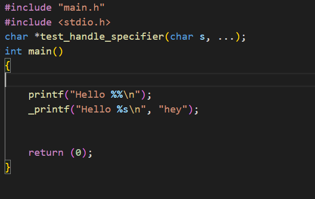

# Printf project

## Overview
The printf project is a custom printf function written in C. The project pulls together all the knowledge gain from the alx-low_level_programming course.

In writing this program, we tried to use a little of the standard library as possible. Only functions like write, exit, malloc, free, va_start, va_end and va_arg were used.

We took a modular approach in building our program. Our program is made up of several small and simpler functions that make up the main `_printf` function.

## Getting Started
To make use of the `_printf` function and every other function defined in our program, you need to include the `main` header file.
Example
```c
#include "main.h"
```

## Usage
**Prototype**: `int _printf(const char *format, ...);`

**Returns**: the number of characters printed (excluding the null byte used to end output to strings)


**Format** is a character string. The **format** string is composed of zero or more directives.
Example Usage:




### Specifiers Handled

- [x] c
- [x] s
- [x] %
- [x] d
- [x] i
- [ ] b
